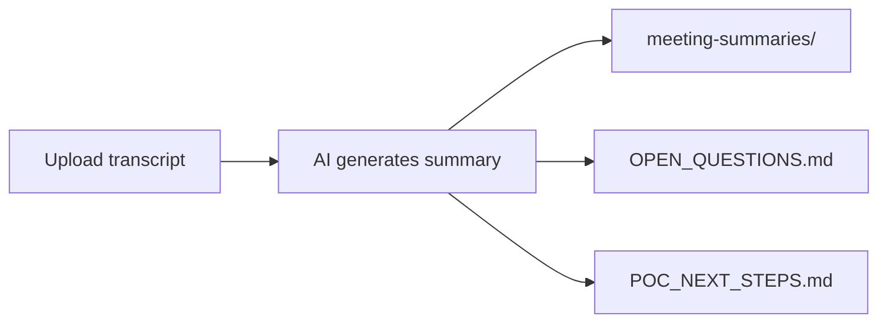

# PM Meeting Notes Template

Turn meeting transcripts into structured, living project documents — **meeting summaries**,
an **open questions register**, and a **next steps** action list — using Cursor.

Built for product owners and program leads who want consistent meeting artifacts without
manual copy-paste across docs.

**Last updated:** 2026-07-08

---

## How it works



### Workflow (3 steps)

1. **Upload your meeting transcript** — paste it into Cursor chat, or drop a file under
   `project-management/transcripts/`.
2. **AI summarizes it** — a new meeting summary is created in
   `project-management/meeting-summaries/` (date, duration, topic, attendees, overview,
   decisions, open questions, action items, notes).
3. **Living docs are updated** — `OPEN_QUESTIONS.md` and `POC_NEXT_STEPS.md` pick up new
   decisions, carried-forward questions, and action items from the transcript.

> **Cursor prompt:** *"Here is the transcript from today's standup — summarize it and update
> the open questions and next steps files."*

The agent skill at `.cursor/skills/meeting-transcript-processor/SKILL.md` defines the exact
format and update rules. The Cursor rule in `.cursor/rules/` applies automatically when
you work in this repo.

---

## Quick start (product owners)

1. **Use this repo for your program**
   - **Option A:** Clone and rename the folder (e.g. `message-bus-pm-notes`).
   - **Option B:** Use GitHub **Use this template** (if enabled) to create your own copy.
2. **Open the folder in Cursor.**
3. **Fill in program context** — edit `project-management/PROGRAM_CONTEXT.md` with your Jira
   boards, repos, people, acronyms, and key doc links. Or ask Cursor: *"Help me set up
   PROGRAM_CONTEXT for my program."*
4. **Replace sample content** — update `OPEN_QUESTIONS.md`, `POC_NEXT_STEPS.md`, and the sample
   kickoff summary.
5. **Upload your first real transcript** — Cursor will ask for any missing context (repos, boards,
   unknown ticket IDs) before summarizing.

---

## Repo layout

```
project-management/
  PROGRAM_CONTEXT.md          # Repos, Jira boards, people, acronyms — read before ingest
  OPEN_QUESTIONS.md           # Decision register — open questions + status
  POC_NEXT_STEPS.md           # Living action list — current plan + history
  meeting-summaries/          # One summary per meeting (generated)
  transcripts/                # Optional: raw transcripts for reference
.cursor/
  skills/meeting-transcript-processor/SKILL.md
  rules/meeting-notes-workflow.mdc
  rules/program-context.mdc
  rules/collaboration.mdc
  rules/standards-bootstrap.mdc
```

---

## Cursor rules setup

This template ships with **four repo rules** and **one skill** under `.cursor/`. They apply
automatically when you open the repo folder in Cursor (not the parent workspace).

| File | Purpose |
|------|---------|
| `rules/standards-bootstrap.mdc` | Tells the agent to load the skill + rules before editing |
| `rules/program-context.mdc` | Asks for repos, Jira boards, people, acronyms when unknown |
| `rules/meeting-notes-workflow.mdc` | Transcript → summary → open questions → next steps format |
| `rules/collaboration.mdc` | Review with you before git; ask when unclear; no guessing decisions |
| `skills/meeting-transcript-processor/SKILL.md` | Step-by-step ingest template and quality rules |
| `project-management/PROGRAM_CONTEXT.md` | **You fill this in** — the agent's lookup table for your program |

These mirror the patterns used in the
[WSI Darwin migration analysis](https://github.com/DarwinCX/wsi-darwin-migration-analysis) repo:
a **workflow rule**, a **collaboration/git hygiene rule**, a **bootstrap rule** that forces the
agent to read skills first, and a **domain skill** for the core task.

### What each rule enforces

**Program context (`program-context.mdc` + `PROGRAM_CONTEXT.md`)**

- On setup or first transcript, **ask you** for Jira boards, repos, people, acronyms, and key docs
- Read `PROGRAM_CONTEXT.md` before every ingest to resolve ticket IDs and repo names
- When a transcript mentions something unknown, **ask** — then update PROGRAM_CONTEXT after you confirm
- Optionally cross-reference linked repos in your workspace when you confirm they're in scope

**Collaboration (`collaboration.mdc`)**

- Show a change summary and **ask you to review before any commit**
- **Never commit or push** unless you explicitly ask
- **Raise questions** when a transcript is ambiguous, incomplete, or contradicts existing docs
- **Do not invent** decisions, owners, or dates — park unknowns in `OPEN_QUESTIONS.md`
- **Preserve history** — don't delete old summaries or historical plan sections without your OK
- After each ingest, list what changed and what's still open

**Meeting notes workflow (`meeting-notes-workflow.mdc`)**

- Standard summary sections: date, duration, topic, attendees, overview, decisions, open questions, actions, notes
- Update `OPEN_QUESTIONS.md` and `POC_NEXT_STEPS.md` on every transcript ingest
- Append and restructure — don't wipe prior content

**Bootstrap (`standards-bootstrap.mdc`)**

- Agent must read the skill + rules before editing `project-management/`

### Optional: Cursor User Rules (global)

Repo rules apply inside this project. For habits you want in **every** Cursor session, add these
under **Cursor Settings → Rules → User Rules** (customize the owner name):

```
- Only create git commits when I explicitly ask. Before committing, show me what changed and wait for my review.
- Never push to the remote unless I explicitly ask.
- Before processing meeting transcripts, read PROGRAM_CONTEXT.md and ask me for missing Jira boards, repos, people, or acronyms.
- When a transcript references an unknown ticket, repo, or term, ask me what it means before assuming.
- Do not invent decisions, owners, or dates — mark unknowns as Open in OPEN_QUESTIONS.md.
- After updating docs, summarize which files changed and what questions remain open.
```

### Forking for your program

When you **Use this template** for a new project:

1. Keep all `.cursor/rules/` and `.cursor/skills/` files as-is (they travel with the repo).
2. Replace sample content in `project-management/`.
3. Optionally add a program-specific rule, e.g. `.cursor/rules/my-program-context.mdc`, with extra
   team or domain facts — or put everything in `PROGRAM_CONTEXT.md` (recommended for POs).

---

## Document formats

### Meeting summary

**Path:** `meeting-summaries/<Topic> - Summary YYYY-MM-DD.md`

| Section | Format |
|---------|--------|
| Header | Date, duration, topic, attendees, related links |
| Overview | 1–3 paragraph narrative |
| Decisions Made | Numbered table |
| Open / Carried Forward | Question + status table |
| Action Items | Action, owner, timing table |
| Notes | Bullets + optional detail tables |

**Sample:** [Sample Project Kickoff - Summary 2026-07-08.md](project-management/meeting-summaries/Sample%20Project%20Kickoff%20-%20Summary%202026-07-08.md)

### Open questions (`OPEN_QUESTIONS.md`)

- Dated **Update** blocks at the top after each meeting ingest
- **Status summary** table: `#`, question, type, blocks, status
- Per-question detail: context, options, recommendation, blocks, decision/status

### Next steps (`POC_NEXT_STEPS.md`)

- **Current plan** at the top — action tables by track/theme with owner and status
- **Historical** sections below for provenance
- Links back to meeting summaries and open questions

---

## Sample content

This template ships with **placeholder content** (sample kickoff meeting, Q1–Q3, starter
action list) so you can see the format before uploading real transcripts. Replace or extend
as you go.

---

## Publish / fork for your program

**Suggested GitHub repo names** (pick one that fits your org):

| Name | Best for |
|------|----------|
| `pm-meeting-notes-template` | General PO template — **recommended** |
| `cursor-meeting-notes-workflow` | Emphasizes Cursor + transcript workflow |
| `meeting-transcript-living-docs` | Descriptive: transcript → living docs |
| `product-owner-meeting-workflow` | Very explicit audience |

After `gh auth login`, from this folder:

```bash
gh repo create DarwinCX/pm-meeting-notes-template \
  --public \
  --source=. \
  --remote=origin \
  --push \
  --description "Cursor template: meeting transcripts → summaries, open questions, and next steps for product owners"
```

To mark it as a GitHub template repo (so POs can click **Use this template**):

```bash
gh repo edit DarwinCX/pm-meeting-notes-template --template
```
